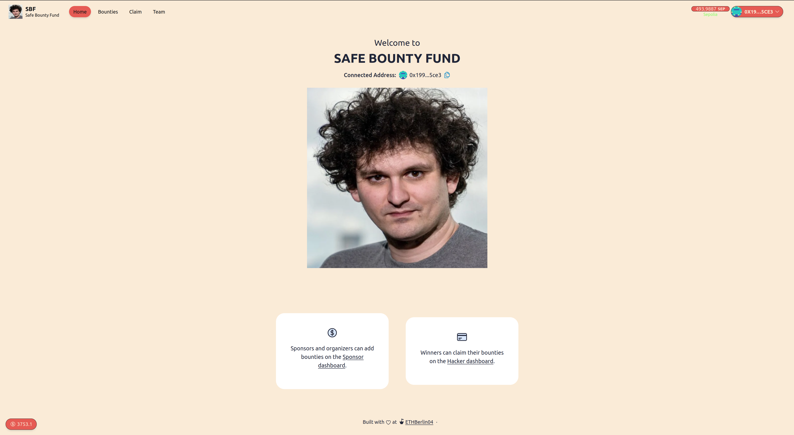
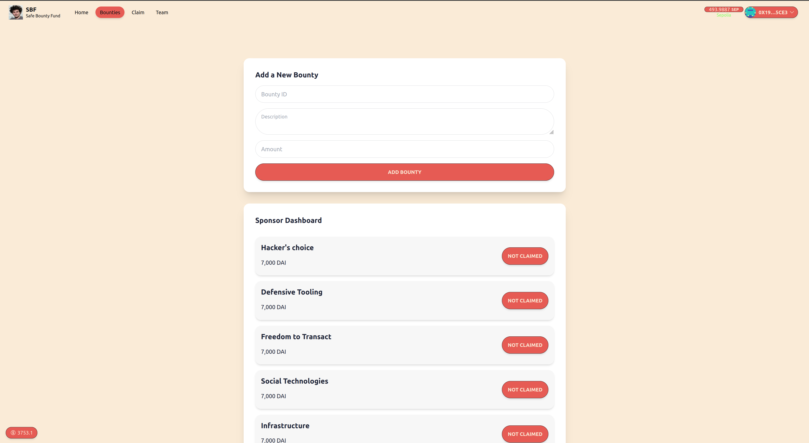
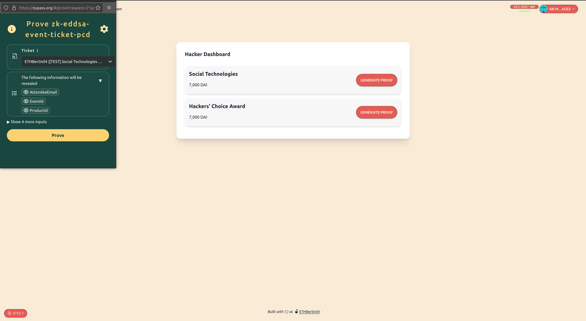
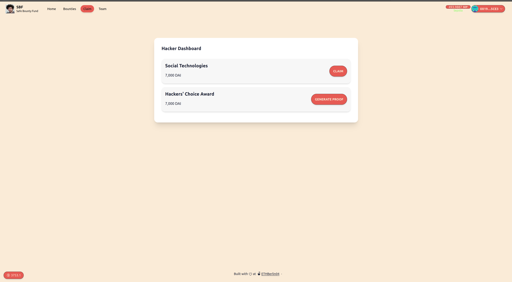

  <h1 align="center">SBF</h1>
  <h3>Safe Bounty Fund</h3>
  

💸 Safe Bounty Fund is a secure way of paying hackers after a hackathon. Before the event, sponsors and organizers can use our dApp to add bounties. They do this by depositing funds in the smart contract and linking it to a Zupass badge idea for this bounty track. After the hackathon, the holders of Zupass winner badges are allowed to claim the corresponding bounties.

## Screenshots

| Landing Page                                  | Bounties dashboard                        |
| --------------------------------------------- | ----------------------------------------- |
|  |  |

| Hacker dashboard                        | Hacker dashboard                |
| --------------------------------------- | ------------------------------- |
|  |  |

## The problem SBF solves

😎 SBF removes all the hassle from hackathon prize management for both sponsors and hackers using the magic of zero-knowledge proofs. Sponsors can effortlessly post bounties and deposit prize money, while hackers can instantly and securely claim their winnings. Say goodbye to chasing sponsors on Discord for months—our solution ensures an efficient, seamless experience for everyone involved.

## Challenges you ran into

🧑‍💻 We found working with the cool tech at [Zupass](https://zupass.org) fun, new and exciting. Our team closely collaborated to understand the zk proofs and how to apply them. We want to give a special thank you to Richard and the Zupass team for helping us with explanation, guidance on code examples and helping us set up a test dev environment with your tech, you guys are amazing.

## Technology used

⚙️ Built using [Zupass](https://zupass.org), [Scaffold-ETH 2](https://scaffoldeth.io/), Solidity, NextJS, Foundry, Wagmi, Viem, and Typescript.

## Hackathon tracks

### Meta Award

🖥️ We developed this open-source solution for hackathon bounty distribution based on our experiences as seasoned hackathon participants. This tool could have saved us significant time, money, and frustration in the past, which is why we were driven to create it.

### Best User Experience

💅 Removing the hassle includes making the user experience smooth. We aimed to enhance the hackathon experience in all aspects, which is why we put effort into creating a sleek and easy-to-use UX for both sponsors and hackers.

## Next steps

Due to the limited time, we could not complete everything we set out to do. Additional features that we plan to add include:

- Cross-chain fund distribution
- Distribute funds between team members (partial claims)
- Keeping the funds and the smartcontract logic secured as a gnosis safe module

## Links

- [Vercel deployment](https://bounty-kings.vercel.app/)
- [Presentation slides](https://docs.google.com/presentation/d/1Ve6jAdFijR18LzaWVAjBa3N_5VS2jSHFuacSU-f5MTE/edit?usp=sharing)
- [Demo video](https://www.loom.com/share/a032dbc1beae416ab2dbd48c27d0710b?sid=b02ad7b2-c82e-49bd-8283-edc159672fa0)
- [Github Smart contracts repo](https://github.com/berlin-bounty-kings/contracts)
- [Github front-end repo](https://github.com/berlin-bounty-kings/frontend)

### Verified smart contracts

- [SafeBountyFund contract on Sepolia](https://sepolia.etherscan.io/address/0x8409b68ac606776c2bf28078529883542fcc4f96)

## Team

This project was build during ETHBERLIN04 by:

- [0xjsi.eth](https://twitter.com/0xjsieth)
- [aliX40](https://x.com/AliX__40)
- [arjanjohan](https://x.com/arjanjohan/)
- [Sebastian](https://www.linkedin.com/in/sebastian-s-a29b93276)
